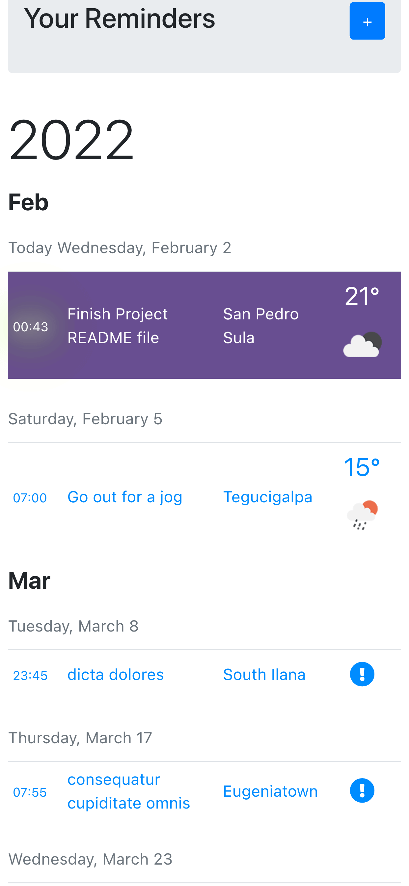
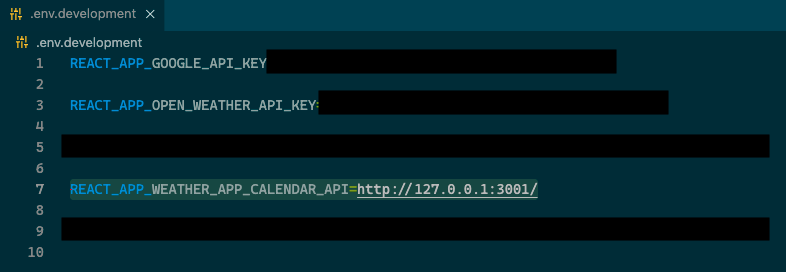

<h1><a href="https://weather-app-calendar.netlify.app/" target="_blank">Weather App Calendar</a></h1>

  
  
  
  
  
  
  
  
  
  
  
  

 

📅  🌡 ☔️ ❄️

 

 

A web app for creating reminders that shows you the weather forecast for your planned activity, based on its geolocation and time.

 

## About
Weather Calendar App is a ***fully responsive*** web app that I built with ***create-react-app and redux toolkit***, that uses a Ruby on Rails REST API to make CRUD operations. The repo for the back-end is [here](https://github.com/StarSheriff2/Weather-App-Calendar---backend).

### File Structure

Some of the technical highlights implemented in this project:
- User authentication and authorization with JWT
- Env variables to hide API secrets and urls
- Google Maps Javascript API for location autocomplete
- Open Weather API to generate weather forecasts up to 7 days
- Create component to continuously check expiration date of the JWT token
- UseEffect hooks
- MSW for API mocking
- React test renderer
- History for smart redirects
- Redux Toolkit
- Formik

### Features:
- Username sign up and sign in
- Create a reminder based on location and time
- See all reminders with a weather forecast for each reminder for up to 7 days
- Fill location data with help from Google Maps Api

### Live Demo

- Deployed to Netlify: [Live Demo](https://weather-app-calendar.netlify.app/)

- For a quick view of the app, log in with the following credentials:
  - email: *foo@bar.com*
  - password: *foobar44A33!*

### Video Presentation

Coming soon...

### Built With
- HTML, CSS, JavaScript
- React
- React Router
- Redux Toolkit
- Axios
- Bootstrap
- Jest
- MSW
- React test renderer
- Formik
- React-places-autocomplete package
- [Google Maps API](https://developers.google.com/maps/documentation/places/web-service/autocomplete)
- [Open Weather API](https://openweathermap.org)

### About the API

- This app consumes a Ruby on Rails API deployed in Render.com.
- Here's the [link to the backend API](https://weatherapp-api.onrender.com).
- Here's [the repo](https://github.com/StarSheriff2/Weather-App-Calendar---backend).

**Note:** The API is deployed under a free tier service in Render.com, so it might take a couple of minutes for the API to spin up from its idle state before it becomes responsive again.

## Getting Started

To get a local copy up and running, follow these simple example steps.

### Prerequisites
- A browser to open the main file
- Node.js
- NPM
- Yarn

### Get files
1. Open your terminal or command prompt.
2. If you do not have git installed in your system, skip this step and go to step 3; otherwise, go to the directory where you want to copy the project files and clone it by copying this text into your command prompt/terminal: `https://github.com/StarSheriff2/Weather-App-Calendar---frontend.git`.
 Now go to the ***"Install Dependencies"*** section
3. Download the program files by clicking on the green button that says “**Code**” on the upper right side of the project frame.
4. You will see a dropdown menu. Click on “**Download ZIP**.”
5. Go to the directory where you downloaded the **ZIP file** and open it. Extract its contents to any directory you want in your system.

### Install Dependencies
1. Go to the root directory of the project
2. In your command line, while in the root dir, type `npm install`. It will install all necessary dependencies in your project files
3. Now type `yarn start` or `npm run start`. It will load the project in your default browser.  
**Note: _This command will not stop on its own. If you change something in your project files, it will recompile and reload the page in your browser. To exit, hit "ctrl + c"_**

### Weather App Calendar API and Third-party APIs Env Files

1. To make this app work in local development you will need a Google Maps API key. You can get one here: https://console.cloud.google.com/

    Once you have your API key do the following:
    - You will need to enable the following APIs:
      - Directions API
      - Geocoding API
      - Geolocation API
      - Maps JavaScript API
      - Places API
    - Create an **.env.development** file in your root folder from the .env.example file
    - Add your Google api key to ***REACT_APP_GOOGLE_API_KEY***=\<your key here\> inside your env file
    - Paste your key where it says "your key here"

2. You will also need an [Open Weather Map API](https://openweathermap.org/api)
    - Go to [their website](https://openweathermap.org/api) and sign up for an account to get an API Key
    - Add your Weather App Map api key to ***REACT_APP_OPEN_WEATHER_API_KEY***=\<your key here\> inside your .env file
    - Paste your key where it says "your key here"

3. Finally, you will also need to create a variable to store the development address:
    - Add the API address:
    <code>REACT_APP_WEATHER_APP_CALENDAR_API=http://127.0.0.1:3001/</code>

      - Your .env.development file should look something like this:
      

## Development

### Bundle project

- `yarn build`
### Testing
To test, run

- `yarn test`

### Linters
To run the linters included in this repository, go to the root directory of your repository and copy/paste the following commands into your terminal:
(**Note:** Make sure you run `npm install` before you do this)
- for ESlint, `npx eslint.`
- for Stylelint, `npx stylelint "**/*.{css,scss}"`

### All Available Scripts

 
In the project directory, you can run:

### `yarn start`

Runs the app in the development mode.\
Open [http://localhost:3000](http://localhost:3000) to view it in the browser.

The page will reload if you make edits.\
You will also see any lint warnings in the console.

### `yarn test`

Launches the test runner in the interactive watch mode.\
See the section about [running tests](https://facebook.github.io/create-react-app/docs/running-tests) for more information.

### `yarn build`

Builds the app for production to the `build` folder.\
It correctly bundles React in production mode and optimizes the build for the best performance.

The build is minified and the filenames include the hashes.\
Your app is ready to be deployed!

See the section about [deployment](https://facebook.github.io/create-react-app/docs/deployment) for more information.

### `yarn eject`

**Note: this is a one-way operation. Once you `eject`, you can’t go back!**

If you aren’t satisfied with the build tool and configuration choices, you can `eject` at any time. This command will remove the single build dependency from your project.

Instead, it will copy all the configuration files and the transitive dependencies (webpack, Babel, ESLint, etc) right into your project so you have full control over them. All of the commands except `eject` will still work, but they will point to the copied scripts so you can tweak them. At this point, you’re on your own.

You don’t have to ever use `eject`. The curated feature set is suitable for small and middle deployments, and you shouldn’t feel obligated to use this feature. However, we understand that this tool wouldn’t be useful if you couldn’t customize it when you are ready for it.

## Usage

- Sign in / sign up
- Create a new reminder
- View all your reminders
- See a weather forecast for each reminder up to 7 days in the future

## Author
👤 **Arturo Alvarez**
- Github: [@StarSheriff2](https://github.com/StarSheriff2)
- Twitter: [@ArturoAlvarezV](https://twitter.com/ArturoAlvarezV)
- Linkedin: [Arturo Alvarez](https://www.linkedin.com/in/arturoalvarezv/)

## 🤝 Contributing

Contributions, issues, and feature requests are welcome!

Feel free to check the [issues page](https://github.com/StarSheriff2/Weather-App-Calendar---frontend/issues).

## 🤝 Acknowledgements

JWT Implementation:
 - Heavy reliance on [this tutorial series to develop this JWT authentication strategy on React and Redux](https://www.bezkoder.com/react-redux-login-example-toolkit-hooks/).

## Show your support

Give a ⭐️ if you like this project!

## 📝 License

This project is [MIT](https://github.com/StarSheriff2/Weather-App-Calendar---frontend/blob/main/LICENSE) licensed.
